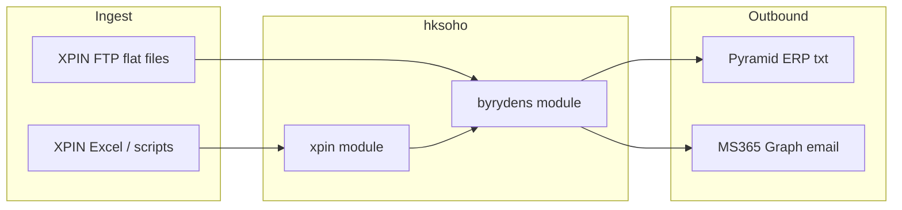
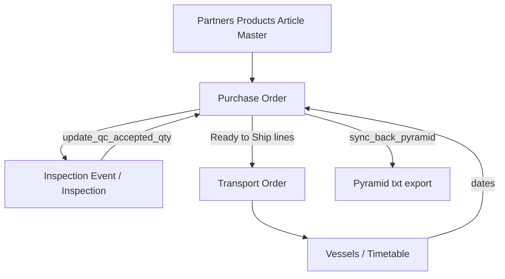

# HKSoHo — Technical Specification

**App:** `hksoho`  
**Framework:** Frappe v15  
**Production site:** `sos.byrydens.com`  
**Scanned from:** `apps/hksoho` on the production bench + live MariaDB  
**Audience:** developers and operators maintaining By Rydéns SOS

This document is the inventory-level spec. For a product overview, see [README.md](README.md).

---

## 1. Purpose

HKSoHo is a tailor-made Frappe app that replaces / complements legacy XPIN sourcing workflows for By Rydéns:

1. Ingest and manage **Purchase Orders** and line quantities
2. Plan and record **quality inspections**
3. Book **transport / shipment** (vessels, containers, ETAs)
4. Maintain **product / article / partner** master data
5. Preserve **legacy XPIN** history for lookup and migration
6. Sync selected data back to **Pyramid ERP** and send **M365** email

---

## 2. Runtime environment

| Item | Value |
|------|--------|
| Bench path | `/home/frappe/frappe-bench` |
| Site | `sos.byrydens.com` |
| DB | MariaDB (site `db_type`) |
| Frappe | v15.x (observed 15.77.0) |
| Python | ≥ 3.10 (`pyproject.toml`) |
| Installed apps | `frappe`, `hksoho`, `print_designer`, `frappe_desk_theme`, `infintrix_theme`, `drive` |

**Production rule:** backup before any DB-affecting change (`bench --site sos.byrydens.com backup`).

---

## 3. Architecture

### Modules (`hksoho/modules.txt`)

| Module | Role |
|--------|------|
| `HKSoHo` | App shell (e.g. `test_html`) |
| `byrydens` | Live operational DocTypes, APIs, reports, workspaces, web forms, imports |
| `xpin` | Legacy DocTypes + migration scripts |

### Key packages

| Path | Contents |
|------|----------|
| `hksoho/byrydens/doctype/` | Operational DocTypes |
| `hksoho/byrydens/importing/` | Hourly CSV/TXT importers |
| `hksoho/byrydens/*_api.py` | Whitelisted desk/web APIs |
| `hksoho/byrydens/customer_quotation_pdf.py` | Quo-Report PDF download override (append print attachments) |
| `hksoho/byrydens/report/` | Script/query reports |
| `hksoho/byrydens/workspace/` | Desk workspaces |
| `hksoho/byrydens/web_form/` | Web forms |
| `hksoho/byrydens/notification/` | PO notify notification (export may drift from live) |
| `hksoho/xpin/` | Legacy DocTypes + import/fix scripts |
| `hksoho/utils/` | MS365 SMTP / email helpers |
| `hksoho/public/` | Desk CSS/JS |
| `hksoho/hooks.py` | Scheduler, doc events, assets, Jinja |

### Site-only vs app export

| Artifact | In app repo | Live site |
|----------|-------------|-----------|
| `PO-Workflow` / `TO-Workflow` | Not exported / no fixtures | Active in DB |
| Notification `PO notify` | JSON export `event: Submit` | Live `event: Value Change` |
| `item-inspection-wizard` published | Often `0` in export | Published `1` |
| `item-inspection-wizard2` | **Missing from app** | Published on live |
| Transport web forms | Present | Unpublished |

---

## 4. Core business flows

1. **Master data** — Partner / Product / Product Group / terms / currency rates (FTP + desk)
2. **PO lifecycle** — import or create PO → workflow transitions → line qty progression (PO is **not** submittable)
3. **Inspection** — Inspection Event schedules lines → Inspection records results → accepted qty written back to PO lines
4. **Transport** — pick Ready-to-Ship / Partial Shipout PO lines onto Transport Order → vessel ETD/ETA → shipment reports
5. **Legacy** — XPIN DocTypes remain queryable for product PO history

---

## 5. DocType inventory

### 5.1 byrydens (operational)

| DocType | Kind | Role |
|---------|------|------|
| Purchase Order | Doc | PO header (buyer/supplier, ports, QC/booking, Pyramid sync flag); `is_submittable = 0` |
| Purchase Order Item | Child | Line qty, QC qty, product refs, ship dates |
| Temporary PO Item | Child | Temporary line staging |
| Inspection | Doc | QC result for a PO line / template |
| Inspection Result | Child | Checklist outcomes |
| Inspection Template | Doc | Reusable checklist definition |
| Inspection Template Item | Child | Checklist rows (Carton/Construction/Product/Shade) |
| Inspection Event | Doc | Multi-PO inspection schedule |
| Inspection Line | Child | Event lines |
| Reminder Log | Doc | Inspection reminder audit |
| Transport Order | Doc | Shipment / booking header |
| Transport Order Line | Child | Shipped PO lines + invoice fields |
| Vessels | Doc | Vessel master |
| Vessels Time Table | Doc | Sailing schedule (CFS/ETD/ETA/free days) |
| Load-Dest Port | Doc | Port reference |
| Product | Doc | Product catalog |
| Product Group | Doc | Product grouping |
| Product Attachment | Doc | Multi-file attachment set |
| Product Attachment Item | Child | Files in a set |
| Product Attachment Link | Child | Link set ↔ products |
| Article Master | Doc | Lighting / article technical specs; Attachments tab includes `product_image` and `files` (`Product Attachment Item`) |
| Customer Quotation | Doc | Customer-facing cost / price worksheet; links Article Master via `articale_master`; **Print Attachments** tab (`print_files`) |
| Customer Quotation File | Child | Selectable print rows: `print`, `description`, `attach_file`, `file_type` |
| Internal Evaluation | Doc | Internal cost build-up |
| Partner | Doc | Supplier / Buyer / Customer / Agent / Transporter |
| Payment Term | Doc | Payment terms |
| Delivery Term | Doc | Incoterms-style delivery terms |
| Currency Rate | Doc | FX rates (FTP import) |
| User Item | Child | User-linked helper rows |

### 5.2 xpin (legacy)

| DocType | Kind | Role |
|---------|------|------|
| xpin_po | Doc | Legacy PO header |
| xpin_po_items | Child | Legacy PO lines |
| xpin_po_doc | Child | Legacy PO documents |
| xpin_po_files | Doc | Legacy file attachments index |
| xpin_orders | Doc | Legacy orders |
| xpin_order_items | Doc | Legacy order lines |
| xpin_order_item_inspections | Doc | Legacy line inspections |
| xpin_inspection_data | Doc | Legacy inspection header data |
| xpin_inspection_items | Doc | Legacy inspection items |
| xpin_inspection_results | Doc | Legacy inspection results |
| xpin_inspection_actions | Doc | Legacy inspection actions |
| xpin_inspection_errors | Doc | Legacy inspection errors |

### 5.3 HKSoHo shell

| DocType | Role |
|---------|------|
| test_html | Shell / leftover test DocType |

---

## 6. Reports

| Report | Type | Ref DocType | Location | Notes |
|--------|------|------------|----------|-------|
| PO detail | Query | Purchase Order | `byrydens/report/po_detail` | Canonical |
| PO-Normal-List | Query | Purchase Order | `byrydens/report/po_normal_list` | Canonical |
| Undelivered Items | Query | Purchase Order | `byrydens/report/undelivered_items` | Canonical |
| Orders Due to Pay | Script | Purchase Order | `byrydens/report/orders_due_to_pay` | Canonical |
| Supplier Products | Script | Product | `byrydens/report/supplier_products` | Canonical |
| Inspection Report -A | Report Builder | Inspection | `byrydens/report/inspection_report__a` | Canonical |
| Shipment On Water Report with status | Query | Transport Order | `byrydens/report/shipment_on_water_report_with_status` | Canonical |
| Shipment On Water Report | — | — | `hksoho/report/shipment_on_water_report` | **Orphan / incomplete** (JS filters only; no Report JSON/Python) |

---

## 7. Workspaces

| Workspace | Notable shortcuts |
|-----------|-------------------|
| Partners | Partner, Role / Permission Manager |
| Products | Product, Article Master, Product Attachment, Customer Quotation, Internal Evaluation |
| Purchase Orders | PO list, Inspection list/event/calendar, Item inspection wizard, Undelivered Items |
| Transports | Transport Order, Vessels, Vessels Time Table |
| Reports | Orders Due To Pay, Shipment On Water, Undelivered Items |
| Utilities | ToDo, Drive, Note |
| XPIN | XPIN PO, XPIN Files, XPIN Inspection Items |

---

## 8. Web forms

| Name | DocType | Route | Live published | In app tree |
|------|---------|-------|----------------|-------------|
| item-inspection-wizard | Inspection | `item-inspection-wizard` | Yes | Yes (export may show `published: 0`) |
| item-inspection-wizard2 | Inspection | `item-inspection-wizard2` | Yes | **No** (site-only) |
| transport-order-detial | Transport Order | `transport-order-detail` | No | Yes (folder typo historical) |
| transport-order2-detail | Transport Order | `transport-order2-detail` | No | Yes |

---

## 9. Hooks & automation

From `hksoho/hooks.py`:

### Scheduler

| When | Callable |
|------|----------|
| Hourly | `hksoho.byrydens.importing.import_csv2product.execute` |
| Hourly | `hksoho.byrydens.importing.import_csv2partner.execute` |
| Hourly | `hksoho.byrydens.importing.import_csv2currency.execute` |
| Hourly | `hksoho.byrydens.importing.import_csv2po.execute` |
| Hourly | `hksoho.byrydens.utils.send_daily_inspection_reminders` |
| Daily | `hksoho.byrydens.inspection_check.execute` |

### Document events

| DocType | Event | Handler |
|---------|-------|---------|
| Purchase Order | `after_save` | `hksoho.byrydens.doctype.purchase_order.purchase_order.after_save` |

### Assets / Jinja

- `app_include_css`: `/assets/hksoho/css/custom2.css`
- Jinja global: `get_image_datauri` → `hksoho.byrydens.utils.get_image_datauri`

### Override whitelisted methods

| Original | Replacement |
|----------|-------------|
| `frappe.utils.print_format.download_pdf` | `hksoho.byrydens.customer_quotation_pdf.download_pdf` |

When `doctype == Customer Quotation` and `format == Quo-Report`, the override merges selected `print_files` (Print checked) after the Quo-Report PDF: PDF pages via pypdf; images via PIL → single-page PDF. Other doctypes/formats call through unchanged.

**Print format note:** `Quo-Report` is a **Print Designer** format stored in the site DB (not exported as app fixtures). HTML print preview is unchanged; attachment append applies to PDF download only.

### Patches / fixtures

- `hksoho/patches.txt` — no active pre/post model sync patches at scan time
- `hooks.py` has **no `fixtures`** — Workflows, Notification live event, and web-form publish flags are site DB state

---

## 10. APIs (whitelist)

### Inspection — `byrydens/inspection_api.py`

- `get_suppliers`, `get_sales_orders`, `get_order_items`, `get_inspection_items`
- `get_po_items`, `get_po_items_qcstatus`
- `add_po_items_to_inspection_event`, `send_inspection_invitation`
- `update_qc_accepted_qty`

### Transport — `byrydens/transport_order_api.py`

- `get_po_items` (Ready to Ship / Partial Shipout)
- `update_to_line_invoice`
- `update_vessel_dates`
- `fix_po_item_order_status_for_shipped_to` — **default `dry_run=False` (mutates)**; prefer dry-run
- `fix_po_item_order_status_and_trigger_before_save` — default `dry_run=True`

### Products / files — `byrydens/product_files_api.py`

- `get_product_attachments`, `link_attachments_to_products`
- `get_po_items_for_product`, `get_purchase_order_items_for_product`
- `get_xpin_po_items_for_product` (+ older variants)
- `get_supplier_allowed_articles`, `get_supplier_product_query`, `check_product_supplier_permission`

### Customer Quotation — print attachments

| Callable | Role |
|----------|------|
| `byrydens.doctype.customer_quotation.customer_quotation.get_article_master_files` | Returns Article Master `product_image` + `files` rows for the CQ fetch button |
| `byrydens.customer_quotation_pdf.download_pdf` | Whitelist override; appends selected CQ files to Quo-Report PDF |
| Desk button | **Fetch Files from Article Master** on Customer Quotation form |

Flow: link `articale_master` → fetch/select files on **Print Attachments** → Print → Quo-Report → PDF.

### Utils — `byrydens/utils.py`

- `load_product_images_to_po_items`, `make_product_images_public`, `get_due_po_details`

### Import / XPIN

- `import_csv2po.reload_single_po_from_txt`
- `xpin.import_xpin_po.import_xpin_po_from_xlsx`

### Notifications

- `notification_utils.convert_to_user_timezone`

---

## 11. Import & utility scripts

### Scheduled / primary (`byrydens/importing/`)

| Script | Role | Site config keys |
|--------|------|------------------|
| `import_csv2product.py` | Products (+ related) from FTP | `partner_import_input_dir`, `partner_import_proceed_dir`, `partner_import_image_dir` |
| `import_csv2partner.py` | Partners from FTP | `partner_import_*` |
| `import_csv2currency.py` | Currency rates from FTP | `currency_import_input_dir`, `currency_import_proceed_dir` |
| `import_csv2po.py` | POs from `po*.txt` + `reload_single_po_from_txt` | `po_import_input_dir`, `po_import_proceed_dir` |
| `import_csv2pgroup.py` | Product groups (supporting) | `partner_import_*` |
| `update_primaryphoto.py` | Primary product photo maintenance | `partner_import_*` |
| `import_doc.py` | Generic doc import helper | — |

PO importer only updates existing POs when `workflow_state` is `Draft` or `Submitted` (`Supplier Confirmed` was commented out).

### Other byrydens helpers

| Script | Role |
|--------|------|
| `Importing_product_image.py` | Product image import |
| `import_product_attachment.py` | Attachment import |
| `inspection_check.py` | Daily Inspection Event completion sync |

### XPIN one-offs (`xpin/`)

| Script | Role |
|--------|------|
| `import_xpin_po.py` | Excel → XPIN PO |
| `import_orders.py` / `import_order_items.py` | Legacy orders |
| `import_inspection_data.py` | Legacy inspections |
| `import_pofiles.py` / `import_popdfreport.py` / `fix_pdfreport.py` | PO files / PDF reports |
| `import_file2product.py` | File ↔ product |
| `find_files.py`, `remove_file_pdf.py`, `update-orderitem.py` | Maintenance |

---

## 12. Integrations

| Integration | Direction | Mechanism | Config |
|-------------|-----------|-----------|--------|
| Microsoft 365 | Outbound email | Graph API wrappers in `hksoho/utils/` | `ms365_*` in site config (secrets) |
| Pyramid ERP | Outbound | `B*.txt` on PO `after_save` when `sync_back_pyramid` and not Draft | Hardcoded `/home/ftpuser/topyramid`, `/home/frappe/topyramid` |
| XPIN FTP | Inbound | Hourly importers | `partner_import_*`, `po_import_*`, `currency_import_*` |
| S3 / Lightsail | Files | Site `private/files` (often `xpin/po` mount) | Ops-level; **never commit keys** |
| Drive app | Desk | Workspace Utilities shortcut | Separate app |

### Notification `PO notify`

| | Repo export | Live site |
|--|-------------|-----------|
| Enabled | 1 | 1 |
| Document | Purchase Order | Purchase Order |
| Event | `Submit` (stale) | **`Value Change`** |
| Note | PO is not submittable | Do not restore Submit without enabling submit |

---

## 13. Workflows and select fields

### PO-Workflow (live, site DB)

Draft → Submitted → Supplier Confirmed → Ready to QC → QC Checked → Ready to Ship → Booked QTY → Partial Shipout → Shipout → Rejected / Cancelled

### TO-Workflow (live, site DB)

Unconfirmed → Empty TO Head → Confirmed → Shipped → ETA Passed → Arrived → Undelivered → Delivered / Cancelled

### Purchase Order select fields (DocType)

- **order_type / PO type:** Standard / Sample / New Item / Spareparts
- **po_status:** Pending / Confirmed / Cancel
- **booking_status / delivery_status:** Pending / Confirmed
- **qc_status:** Pending / Pass / Failure / Re-inspection
- **Transport mode:** BY TRUCK / BY BOAT / BY SHIP&AIR / BY AIR
- **sync_back_pyramid:** flag controlling Pyramid export on save

### Transport Order notes

- `read_only_depends_on` on items currently duplicates `'Undelivered'` in the options list (cosmetic bug in JSON)

---

## 14. Security & operations notes

1. Treat `sos.byrydens.com` as production; avoid speculative schema edits.
2. Before DocType JSON, patches, fixtures, or write SQL: run `bench --site sos.byrydens.com backup` (add `--with-files` if file storage is involved).
3. Never commit `site_config.json` secrets, AWS keys, or FTP passwords into this repo, docs, or bench-root markdown.
4. Prefer `developer_mode: 0` on production unless actively customizing.
5. Whitelisted maintenance APIs (`fix_po_item_order_status_*`) can mutate many rows — run dry-run first; note unsafe default on `fix_po_item_order_status_for_shipped_to`.
6. Scheduler can be paused via site `pause_scheduler`; confirm before debugging “missing imports”.

---

## 15. Known issues (audit)

### Critical / high

- Plaintext cloud credentials must not remain in bench markdown files
- Production `developer_mode` often left on
- `fix_po_item_order_status_for_shipped_to(dry_run=False)` mutates by default

### Medium

- Orphan incomplete shipment report under `hksoho/report/shipment_on_water_report/`
- TO `read_only_depends_on` duplicated `'Undelivered'`
- PO FTP import blocked beyond `Draft`/`Submitted`
- Pyramid paths hardcoded; product importer uses `partner_import_*` key names
- No fixtures for Workflows / Notification / web-form publish state
- App working tree may be dirty vs `upstream/main` (DocTypes, workspaces, untracked reports)

### Low

- Scheduler “already in queue” skip messages under load
- `test_html` leftover DocType
- `transport-order-detial` folder typo

---

## 16. Document control

| Field | Value |
|-------|--------|
| Spec version | 1.2 |
| Source of truth | Code under `apps/hksoho` + live site DocTypes/Workflows |
| Last full scan | 2026-09-08 |
| Docs aligned to audit | 2026-09-11 |
| Quo-Report print attachments | 2026-09-11 |
| Maintainer | HKSoHo (`paul@hksoho.net`) |

When DocTypes, hooks, or integrations change, update this SPEC and the README feature tables in the same change set.
